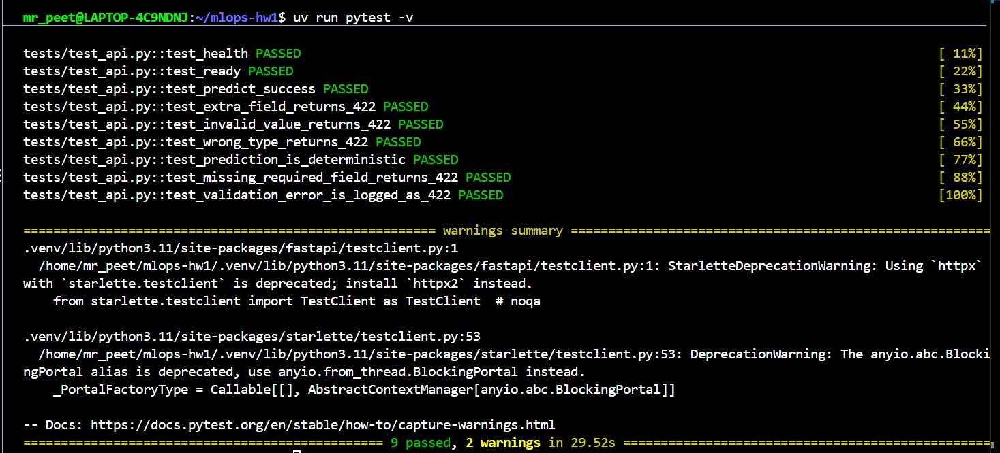
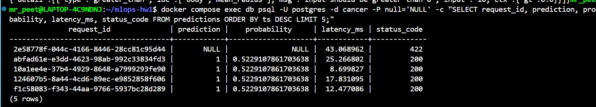
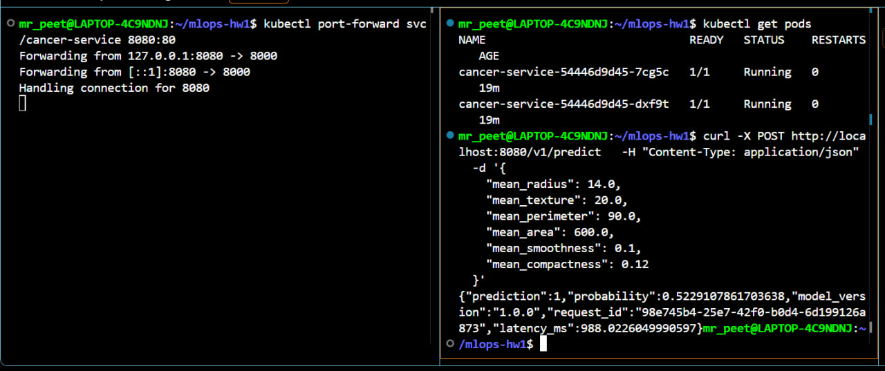
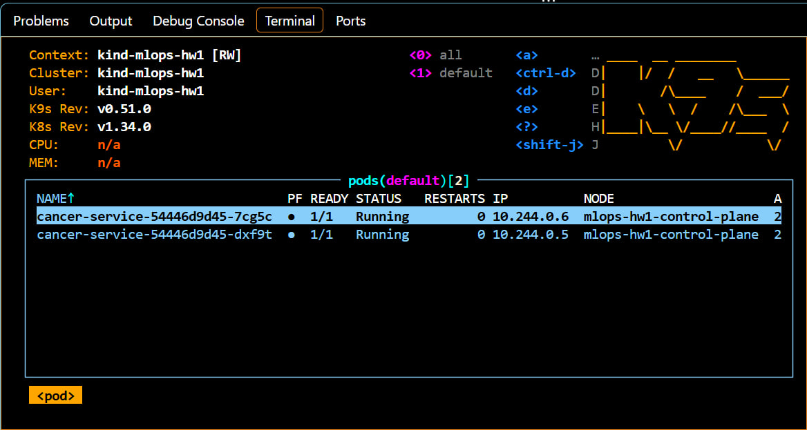
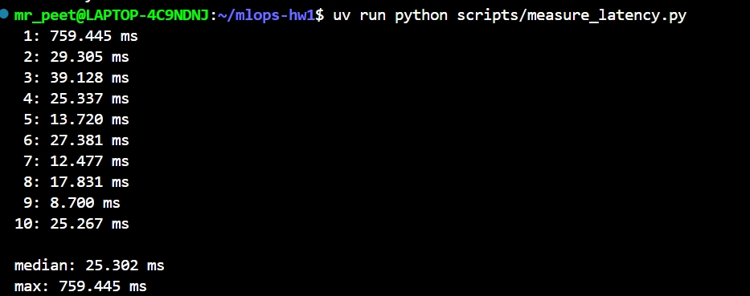

# Отчёт по домашнему заданию №1

## 1. Артефакт модели

Используется датасет Breast Cancer Wisconsin из
`scikit-learn`.

Задача — бинарная классификация.

Модель состоит из:

- `StandardScaler`;
- `LogisticRegression`.

Используются признаки:

- mean radius;
- mean texture;
- mean perimeter;
- mean area;
- mean smoothness;
- mean compactness.

Артефакт `artifacts/model.joblib` содержит:

- `pipeline`;
- `metadata`;
- версию модели `1.0.0`;
- список признаков в правильном порядке;
- threshold `0.5`;
- test accuracy.

### Семантика классов

В датасете Breast Cancer Wisconsin:

- класс `0` соответствует `malignant`;
- класс `1` соответствует `benign`.

Поле `probability` в API содержит вероятность класса `1`, то есть
`P(benign)`.

В первой версии сервиса эта семантика явно не указывалась, поэтому ответ
`prediction = 1, probability = 0.52` можно было ошибочно интерпретировать
как вероятность злокачественной опухоли.

После ревью контракт был уточнён. Теперь API дополнительно возвращает:

- `prediction_label`;
- `probability_class`.

Соответствие классов также хранится в metadata артефакта.

---

## 2. FastAPI-сервис

Реализованы endpoints:

- `GET /health`;
- `GET /ready`;
- `POST /v1/predict`;
- `/docs`.

Модель загружается один раз при запуске приложения через lifespan.

Ответ `/v1/predict` содержит:

- prediction;
- probability;
- model_version;
- request_id;
- latency_ms.

Для входной схемы используется Pydantic с ограничениями значений и
`extra="forbid"`.

---

## 3. Тестирование

Реализовано 9 автоматических тестов:

1. `/health` возвращает успешный ответ.
2. `/ready` возвращает успешный ответ и актуальную версию модели.
3. Smoke-тест проверяет корректное предсказание, диапазон вероятности и типы полей ответа.
4. Лишнее поле возвращает HTTP 422.
5. Значение признака вне допустимого диапазона возвращает HTTP 422.
6. Неверный тип значения возвращает HTTP 422.
7. Один и тот же вход дважды даёт одинаковое предсказание и вероятность.
8. Отсутствие обязательного поля возвращает HTTP 422.
9. Ошибка валидации логируется со `status_code = 422`; поля `prediction`
   и `probability` при этом равны `NULL`, поскольку модель для невалидного
   запроса не вызывается.

Девятый тест был добавлен после ревью домашнего задания. Он проверяет,
что `status_code` в таблице логов содержит полезную информацию, а не
всегда принимает значение `200`.

Все тесты успешно проходят:

`9 passed`

---

## 4. PostgreSQL и Docker Compose

В таблицу записываются как успешные запросы (`200`), так и запросы,
отклонённые валидацией (`422`).

Для запросов с `422` поля `prediction` и `probability` имеют значение
`NULL`, поскольку модель для такого входа не вызывается.

Каждый успешный запрос `/v1/predict` записывается в таблицу `predictions`.

Сохраняются:

- request_id;
- время запроса;
- версия модели;
- признаки в JSONB;
- prediction;
- probability;
- latency_ms;
- status_code.

Если `DATABASE_URL` отсутствует, сервис продолжает работать без записи
в PostgreSQL.

Docker Compose поднимает:

- FastAPI-сервис;
- PostgreSQL 16.

Для PostgreSQL настроен healthcheck, а API зависит от готовности базы.

После ревью логирование было расширено.

Теперь в таблицу записываются:

- успешные запросы со `status_code = 200`;
- запросы, отклонённые валидацией, со `status_code = 422`.

Для запроса с `422` модель не вызывается, поэтому поля `prediction`
и `probability` имеют SQL-значение `NULL`.

---

## 5. Kubernetes

Сервис развернут в локальном kind-кластере.

Deployment содержит:

- 2 replicas;
- startupProbe;
- livenessProbe;
- readinessProbe;
- CPU requests и limits;
- memory requests и limits.

Для доступа к pod'ам используется `ClusterIP` Service.

Работа модели проверена через `kubectl port-forward`.

### k9s

Обе реплики сервиса работают в кластере.

---

## 6. Latency

Для анализа задержки было выполнено 10 последовательных запросов
к `/v1/predict`.

Результат:

- median latency: `25.302 ms`;
- max latency: `759.445 ms`;
- после первого запроса значения в основном находились примерно
  в диапазоне `9–39 ms`.

Высокое значение максимальной latency связано с первым обращением после
старта сервиса — cold-start эффектом. После прогрева задержка стабилизируется
на уровне десятков миллисекунд.

Таким образом, значения около 900 ms на первоначальных скриншотах не
являются типичной latency сервиса.

---

## 6. Журнал проблем

### IndentationError

После добавления фоновой записи предсказаний возникла ошибка:

`IndentationError: unexpected indent`

Причиной был неправильный отступ у `background_tasks.add_task`.

После исправления отступов все тесты снова прошли.

### README отсутствовал внутри Docker image

При сборке Docker возникла ошибка:

`failed to open file /app/README.md`

`uv` пытался установить проект, но `README.md`, указанный в
`pyproject.toml`, ещё не был скопирован в image.

В Dockerfile `README.md` был добавлен в `COPY` до второго `uv sync`.

### ghcr.io был недоступен

Во время сборки Docker возникла ошибка:

`failed to fetch anonymous token`

и DNS timeout при обращении к `ghcr.io`.

Причиной оказался включённый VPN. После его отключения все получилось

## Ошибки которые были устранены после ревью

### Неоднозначная семантика предсказания

В первоначальной версии API возвращал только числовые `prediction` и
`probability`, поэтому было неочевидно, что класс `1` означает `benign`,
а вероятность относится именно к этому классу.

В metadata было добавлено соответствие классов, а API теперь возвращает
`prediction_label` и `probability_class`.

### Поле status_code всегда содержало 200

Первоначально запись в PostgreSQL выполнялась только внутри успешного
обработчика `/v1/predict`, а значение `200` передавалось литералом.
Невалидные запросы завершались на этапе Pydantic-валидации и в таблицу
не попадали.

Был добавлен обработчик `RequestValidationError`. Теперь запросы с
ошибкой валидации также логируются с `status_code = 422`, при этом
`prediction` и `probability` равны `NULL`.

Для этой логики добавлен отдельный девятый автоматический тест.

### Лишний пакет после uv init

После `uv init` в проекте оставался шаблонный пакет `mlops_hw1` с
`Hello from mlops-hw1!`.

Проект был очищен: рабочим Python-пакетом является `cancer_service`,
он явно указан для build backend, а необходимость в ручном
`PYTHONPATH=/app/src` была устранена.
