# 1. Платформа в Kubernetes

## Что сделано

Создан kind-кластер `mlops-hw1` с пробросом порта `80` на host.

В кластере развернуты:

- Traefik как Ingress Controller;
- MLflow Tracking Server и Model Registry;
- PostgreSQL;
- `cancer-service`;
- Ingress для `mlflow.localhost` и `cancer.localhost`.

Для MLflow используются настройки:

```text
--allowed-hosts=mlflow*,mlflow.mlops*,mlflow.localhost*,localhost*,127.0.0.1*
--cors-allowed-origins=http://mlflow.localhost
```

Также отключён Job Execution:

```text
MLFLOW_SERVER_ENABLE_JOB_EXECUTION=false
```

Для хранения состояния MLflow используется PVC `mlflow-data` размером 2 GiB.

## Ingress

```text
mlflow.localhost -> mlflow:5000
cancer.localhost -> cancer-service:80
```

## Доказательства

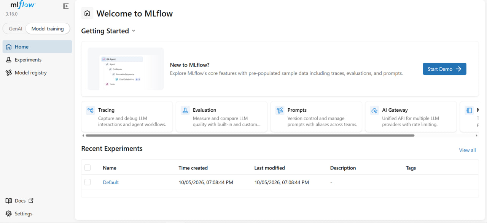

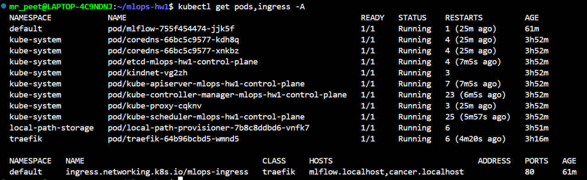

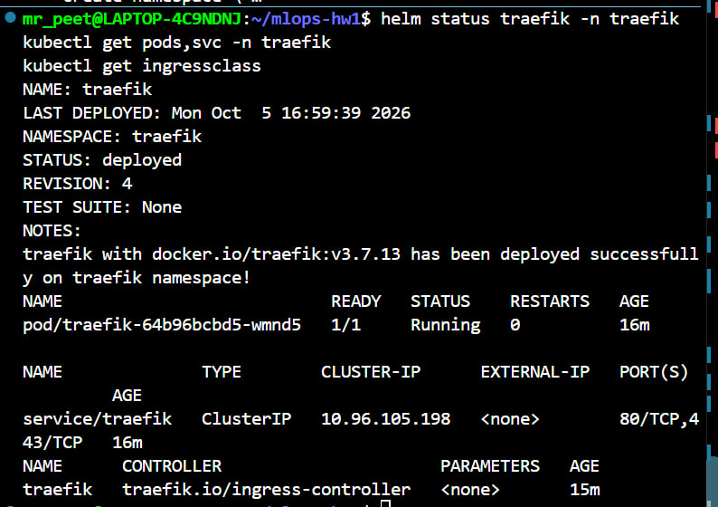

## Статус

✅ Выполнено


---

# 2. Обучение, Model Registry и model gate

## Обучение

Обучение реализовано в `src/cancer_service/train.py`.

В MLflow для каждого запуска сохраняются:

- параметры модели;
- метрики;
- `data_md5`;
- `metadata.json`;
- sklearn-модель;
- дополнительный артефакт `confusion_matrix.png`.

Модель регистрируется под именем `cancer-classifier`.

## Алиасы

Каждая новая версия получает alias `challenger`. Alias `champion` переносится на новую версию только при успешном прохождении model gate.

## Метрика gate

Используется `F1 malignant`, то есть F1 для класса `malignant`.

Для задачи определения злокачественной опухоли одной accuracy недостаточно: важно одновременно учитывать precision и recall для критичного класса. Поэтому F1 для `malignant` лучше отражает качество модели для задачи.

Порог улучшения:

```text
MIN_GAIN = 0.01
```

Новая версия должна улучшить F1 минимум на 0.01, чтобы случайное небольшое изменение метрики не приводило к автоматической смене production-модели.

## Три последовательных запуска

| Версия | C | F1 malignant | Gate | Результат |
|---|---:|---:|---|---|
| v1 | 0.003 | 0.8649 | PASS | первый champion |
| v2 | 0.001 | 0.5517 | FAIL | champion остаётся v1 |
| v3 | 0.01 | 0.9000 | PASS | новый champion |

```text
v1: F1=0.8649 -> GATE PASS (first champion)
v2: F1=0.5517 < 0.8649 + 0.0100 -> GATE FAIL
v3: F1=0.9000 >= 0.8649 + 0.0100 -> GATE PASS
```

## Доказательства

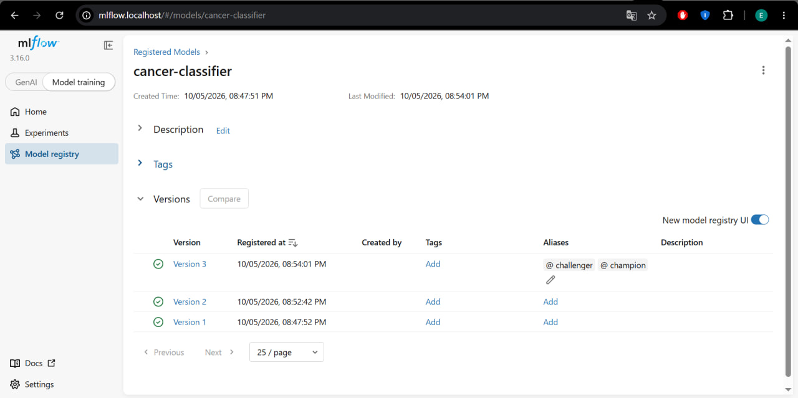

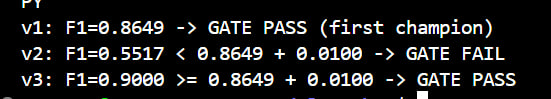

## Статус

✅ Выполнено


---

# 3. Сервис по alias и rollback модели

## Загрузка модели

Если задано `MODEL_NAME=cancer-classifier`, сервис при startup загружает:

```text
models:/cancer-classifier@champion
```

Если `MODEL_NAME` не задан, используется локальный `model.joblib`, поэтому unit-тесты могут выполняться без MLflow.

Endpoint `/health` возвращает фактически загруженную registry version.

## До rollback

```json
{"status":"ok","log_level":"INFO","model_version":"3"}
```

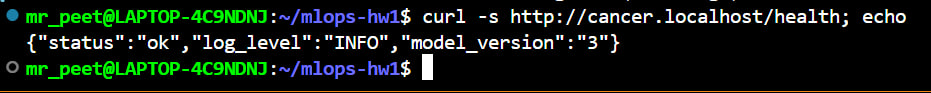

## Rollback

В MLflow UI alias `champion` был перенесён с Version 3 на Version 1. После этого без пересборки Docker image выполнены:

```bash
kubectl rollout restart deployment/cancer-service
kubectl rollout status deployment/cancer-service
```

После rollout:

```json
{"status":"ok","log_level":"INFO","model_version":"1"}
```

Время от переключения alias до ответа сервиса со старой версией:

```text
177 секунд
```

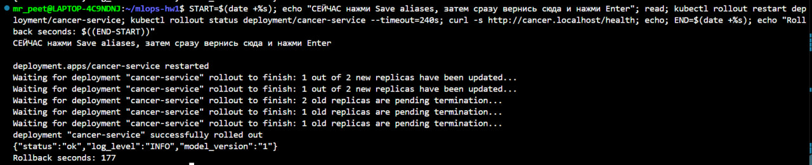

После проверки alias `champion` был возвращён на Version 3, сервис снова начал отвечать `model_version = 3`.

## Вывод

Rollback модели выполнен без изменения кода и без пересборки Docker image: достаточно изменить alias в Registry и перезапустить pod.

## Статус

✅ Выполнено


---

# 4. CI/CD в локальный kind-кластер

## Статус

⏳ В процессе

Этот блок ещё не завершён.

По заданию необходимо:

- запустить self-hosted GitHub Actions runner в Docker;
- подключить runner к Docker network `kind`;
- назначить labels `[self-hosted, kind]`;
- выполнять `deploy` на self-hosted runner;
- создавать Secret идемпотентно через `--dry-run=client -o yaml | kubectl apply -f -`;
- выполнять smoke-test через Ingress;
- проверить registry version в `/health`;
- проверить осмысленный ответ модели;
- проверить наличие в PostgreSQL строки с конкретным `request_id`;
- включить approval для external contributors;
- после сдачи выключить и удалить runner.

## Что добавить после выполнения

- ссылку на зелёный GitHub Actions run;
- Runner name из лога `deploy`;
- скрин `Settings -> Actions -> Runners`;
- описание smoke-test;
- при необходимости ссылку на PR.


---

# 5. Версионирование данных с DVC

## Настройка

DVC добавлен как dev-зависимость и инициализирован:

```bash
uv add --dev dvc
uv run dvc init
```

Remote:

```text
../dvc-storage
```

Сам CSV больше не хранится в Git. В Git хранится указатель:

```text
data/breast_cancer.csv.dvc
```

## Версия v1

Исходный датасет:

```text
shape = (569, 31)
```

DVC md5:

```text
5afc23b9622f8f9ffa60824f4e97d0d5
```

Этот же hash записан в MLflow как `data_md5` для Model Version 3.

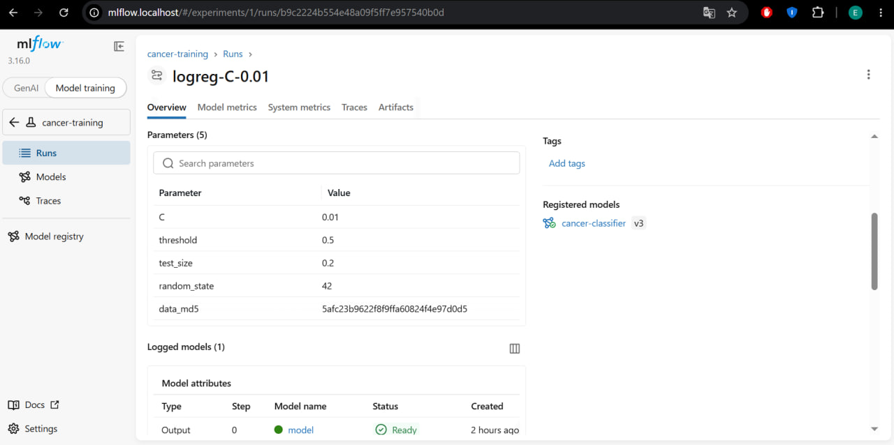

## Версия v2

Перед изменением:

```text
Duplicates: 0
Missing values: 0
```

Так как естественной очистки по дублям/пропускам не требовалось, создана новая осмысленная версия: оставлены только 6 признаков, реально используемых моделью, и `target`.

```text
shape = (569, 7)
```

Новый DVC md5:

```text
6223e074879548a89f618a95238694e6
```

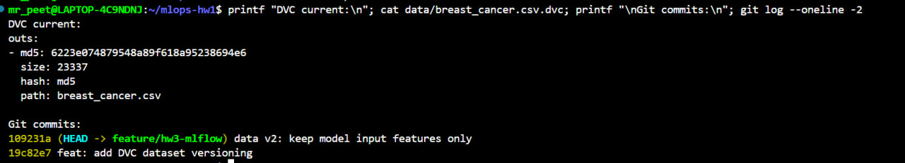

На v2 выполнен новый training run:

```text
Registered version: 4
Data MD5: 6223e074879548a89f618a95238694e6
F1 malignant: 0.9000
GATE: FAIL - 0.9000 < 0.9000 + 0.0100
Champion remains version 3
Challenger -> version 4
```

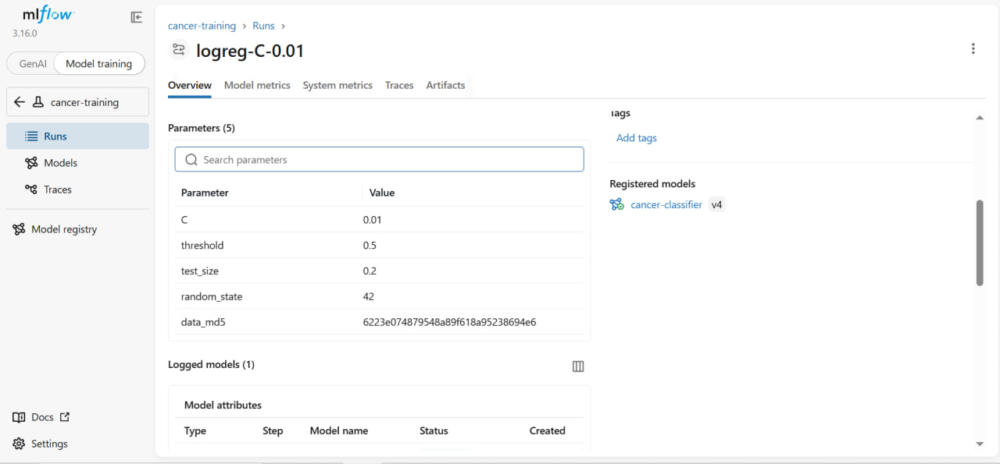

Таким образом, `md5` в DVC совпадает с `data_md5` соответствующего MLflow run.

## dvc push

```text
1 file pushed
```

## dvc diff

```text
Modified:
    data/breast_cancer.csv

files summary: 1 modified
```

## Проверка rollback данных

Проверен откат `v2 -> v1 -> v2`.

После v1:

```text
Shape: (569, 31)
```

После возврата v2:

```text
Shape: (569, 7)
```

## Проверка в чистом клоне

После `uv run dvc pull`:

```text
A       data/breast_cancer.csv
1 file fetched and 1 file added
```

Это подтверждает, что CSV полностью восстанавливается из DVC remote.

## Статус

✅ Выполнено


---

# 6. Автомасштабирование HPA

## Статус

⏳ В процессе

Блок HPA пока не выполнялся.

По заданию необходимо:

1. Установить `metrics-server`.
2. Добавить `--kubelet-insecure-tls`.
3. Создать `k8s/hpa.yaml` с `minReplicas: 2`, `maxReplicas: 6`, target CPU 60%.
4. Запустить нагрузку через Ingress.
5. Зафиксировать рост и падение количества pod.
6. Получить события `SuccessfulRescale`.
7. Собрать таблицу минимум из трёх прогонов: пользователи, реплики, p95, CPU на pod.
8. Сравнить `requests.memory` до и после фактического замера.

## Что добавить после выполнения

- скрин или вывод `kubectl get hpa -w`;
- `kubectl describe hpa` с `SuccessfulRescale`;
- таблицу нагрузочных прогонов;
- расчёт ожидаемого числа реплик;
- объяснение scale-down delay.


---

# 7. Три красных CI-прогона с диагнозом

## Статус

⏳ В процессе

По заданию нужно воспроизвести три ошибки отдельными коммитами и затем починить каждую следующим коммитом.

## 1. Модели нет в Registry

Указать alias, которого не существует, например `prod`.

Нужно приложить красный run, зелёный run после исправления, сообщение ошибки и краткий диагноз.

## 2. Runner не видит кластер

Указать неправильный `KIND_CLUSTER`.

Нужно приложить красный и зелёный run и объяснить, как причина определяется из лога.

## 3. Ingress host не совпадает со smoke-test

Сделать host в `k8s/ingress.yaml` отличным от host, который вызывает smoke-test.

Нужно приложить красный и зелёный run и объяснить причину.


---

# 8. Ответы на вопросы

## 1. Почему tests и build идут в GitHub, а deploy требует self-hosted runner?

`tests` и `build` не требуют доступа к локальному Kubernetes-кластеру, поэтому их можно выполнять на GitHub-hosted runner. Локальный kind-кластер находится за NAT, поэтому обычный GitHub runner не может напрямую обратиться к его Kubernetes API.

Альтернативами могли бы быть VPN, tunnel или pull-based GitOps. Self-hosted runner удобен тем, что сам устанавливает исходящее соединение с GitHub, но при этом имеет локальный доступ к Docker и kind.

## 2. Зачем runner нужны `--network kind`, Docker socket и `--group-add 0`?

`--network kind` помещает runner в Docker-сеть, где находятся node-контейнеры kind. Docker socket нужен для выполнения Docker-команд из runner-контейнера. `--group-add 0` нужен для доступа к смонтированному Docker socket; без необходимых прав Docker-команды могут завершаться `Permission denied`.

Практическая проверка будет добавлена после настройки runner.

## 3. Почему Secret создаётся через `--dry-run=client -o yaml | kubectl apply`?

Обычный `kubectl create secret` не идемпотентен: при повторном deploy Secret уже существует, и команда завершается `AlreadyExists`.

Комбинация `--dry-run=client -o yaml | kubectl apply -f -` генерирует YAML и создаёт либо обновляет ресурс, поэтому deploy можно выполнять повторно.

## 4. Чем challenger отличается от champion?

`challenger` — новая модель-кандидат, которая может быть хуже текущей production-модели. `champion` — версия, прошедшая model gate и выбранная для использования сервисом.

Сервис обращается к alias, а не к номеру версии, поэтому смена модели не требует изменения кода или Docker image. Rollback через alias меняет ML-модель, а `kubectl rollout undo` откатывает Deployment и версию приложения/образа.

## 5. Что будет, если задеплоить сервис в кластер, где модель ещё не обучена?

Если `MODEL_NAME` задан, а нужной модели или alias `champion` в Registry нет, приложение не сможет завершить startup. Pod останется `0/1`, начнёт перезапускаться и может перейти в `CrashLoopBackOff`.

В CI `kubectl rollout status` завершится ошибкой по timeout либо smoke-test не сможет получить корректный `/health`. Практический красный run будет добавлен позже.

## 6. Как запрос браузера попадает в MLflow?

Путь запроса:

```text
Browser
-> localhost:80
-> kind extraPortMappings
-> control-plane:80
-> Traefik
-> Ingress rule for mlflow.localhost
-> Service mlflow:5000
-> MLflow pod
```

`--allowed-hosts` ограничивает допустимые HTTP Host и защищает сервер, в том числе от DNS rebinding. `--cors-allowed-origins` разрешает браузерному UI выполнять запросы с origin `http://mlflow.localhost`.

Порт 80 задаётся при создании kind node-контейнера через `extraPortMappings`, поэтому обычным Kubernetes manifest после создания кластера его добавить нельзя.

## 7. Сколько реплик должен выставить HPA?

Пока не заполнено: нагрузочный тест HPA ещё не выполнялся. После него нужно взять фактический CPU, рассчитать ожидаемое число реплик, сравнить с реальным HPA и объяснить задержку scale-down.

## 8. Что находится в Git, а что в DVC? Как восстановить данные для Model Version N?

В Git находятся код, конфигурация и `.dvc`-указатель. Сам `data/breast_cancer.csv` хранится в DVC remote.

Чтобы восстановить данные для Model Version N: открыть нужную версию в MLflow, найти её run и `data_md5`; в истории Git найти `.dvc`-файл с тем же md5; переключить этот `.dvc`-указатель и выполнить `uv run dvc checkout` или в свежем clone `uv run dvc pull`.


---

# 9. Журнал проблем

## 1. Недостаточно ресурсов WSL

### Симптом

WSL изначально видел около 2.8 GiB RAM и 1 GiB swap. Во время работы Kubernetes появлялись нестабильность API server, TLS/EOF и обрывы соединения.

### Причина

Для kind + MLflow + PostgreSQL + сервиса было недостаточно ресурсов.

### Исправление

```ini
[wsl2]
memory=5GB
swap=4GB
```

После перезапуска WSL стало доступно около 4.8 GiB RAM и 4 GiB swap.

## 2. Traefik оставался в `LoadBalancer <pending>`

### Симптом

Helm ожидал готовности, Service Traefik оставался `LoadBalancer` с `<pending>`.

### Причина

Тип Service был задан не в том месте values для используемой версии chart.

### Исправление

```yaml
ports:
  web:
    hostPort: 80

service:
  spec:
    type: ClusterIP
```

После повторного `helm upgrade --install` Traefik успешно запустился.

## 3. MLflow возвращал 403 сервису

### Симптом

`cancer-service` переходил в `CrashLoopBackOff`.

```text
MlflowException: API request ... failed with error code 403
Invalid Host header - possible DNS rebinding attack detected
```

### Как нашли причину

Traceback указывал на `get_model_version_by_alias`. Сервис обращался к MLflow по `http://mlflow:5000`, поэтому Host был `mlflow`.

### Причина

В `--allowed-hosts` не было внутреннего Kubernetes hostname `mlflow`.

### Исправление

```text
--allowed-hosts=mlflow*,mlflow.mlops*,mlflow.localhost*,localhost*,127.0.0.1*
```

После обновления MLflow запросы стали возвращать `200 OK`, pod сервиса перешли в `1/1 Running`.

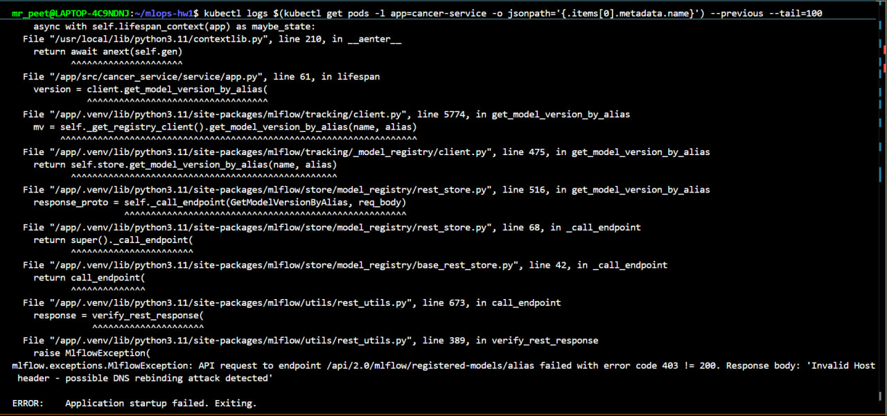

## 4. Загрузка Docker image в kind перегрузила WSL

### Симптом

Во время первой команды `kind load docker-image cancer-service:1.0 --name mlops-hw1` VS Code потерял соединение с WSL.

### Диагностика

После перезагрузки команда `crictl images | grep cancer-service` показала, что образ не успел загрузиться.

### Исправление

После полной перезагрузки `kind load` был выполнен повторно. После успешной загрузки внутри kind появился образ:

```text
docker.io/library/cancer-service   1.0   ...   330MB
```

После этого Deployment удалось запустить.
